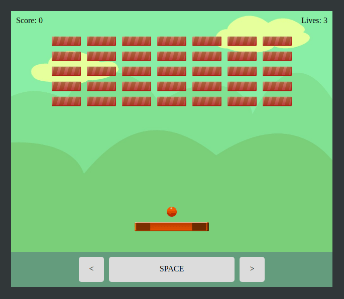

# PrestoDOM Breakout Demo

PrestoDOM is a new in-development UI library written in PureScript language by Juspay Technologies Pvt. Ltd.

This repository showcases the capabilities of the library by making a Breakout game that you can play with the keyboard.

**PS:** The PrestoDOM library is internal at the moment, so you need access to it in order to compile this source code. We are going to open source it soon, so until then, you can browse the code to see how it is done. This notice will be removed once the code is made public for everyone.

## Cloning the repository

~~~sh
$ git clone https://github.com/sriharshachilakapati/prestodom-breakout-demo/
$ npm i
$ bower i
~~~

## Running in the server

~~~sh
$ npm start
~~~

Once that is done, browse to http://localhost:8080/ to play the game.

## Compiling for distribution

~~~sh
$ npm run compile-ps
$ npm run compile-js
~~~

Now package everything in the dist directory and distribute.
